# Дипломный практикум в YandexCloud

## Цели:

1. Зарегистрировать доменное имя (любое на ваш выбор в любой доменной зоне).
2. Подготовить инфраструктуру с помощью Terraform на базе облачного провайдера YandexCloud.
3. Настроить внешний Reverse Proxy на основе Nginx и LetsEncrypt.
4. Настроить кластер MySQL.
5. Установить WordPress.
6. Развернуть Gitlab CE и Gitlab Runner.
7. Настроить CI/CD для автоматического развёртывания приложения.
8. Настроить мониторинг инфраструктуры с помощью стека: Prometheus, Alert Manager и Grafana.

---
## Этапы выполнения:

### Регистрация доменного имени

На [nic.ru](https://nic.ru) зарегистрирован домен `devopsik.ru`.

Настроены DNS:
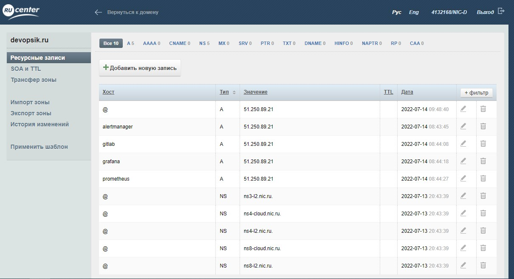

### Создание инфраструктуры

Создан S3 bucket в YC.
 
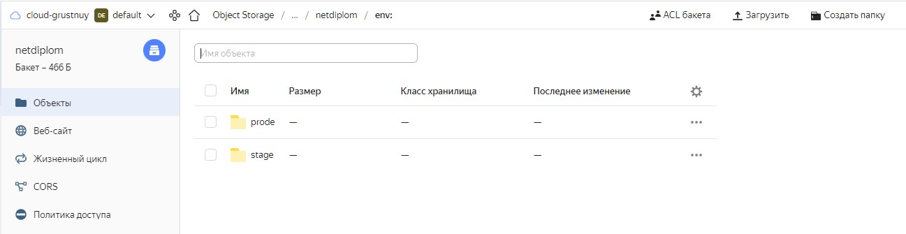


Для развертывания инфраструктуры:
- подставляем в `providers.tf` данные для провайдера;
- подставляем в `meta.txt` login и открытый ключ;
- в `variables.tf` указывается зарезервированный ip адрес для front instance
- выполняем `terraform apply`.

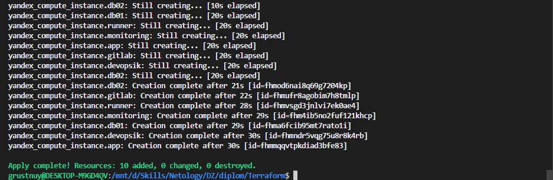

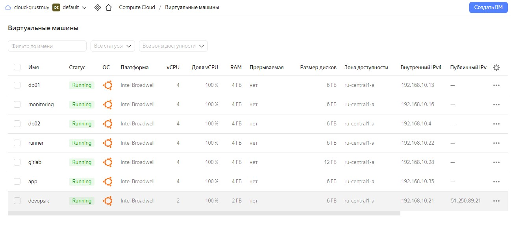
---
## Description

Используемая версия Ansible 2.9.0
	
В файле `hosts` находится inventory для playbook и переменные для ansible ssh proxy.
	
В каталоге [Ansible](src/Ansible) находяться необходимые роли. Установка разделена по сервисам и выполнянться в cледующем порядке:
	
- front.yml (Nginx, LetsEncrypt, службу proxy, Node_Exporter)
- MySQL.yml (установка и настройка MySQL кластера)
- wordpress.yml (Nginx, Memcached, php5, Wordpress)
- gitlab.yml (установка Gitlab)
- runner.yml (установка Runner Gitlab)
- NodeExporter.yml (установка NodeExporter на все хосты)
- monitoring.yml (разворачивание мониторинга)
	
	
Для переключения между stage и prod запросами сертификатов следует отредактировать tasks с именем Create letsencrypt certificate в файле [Ansible/roles/Install_Nginx_LetsEncrypt/tasks/main.yml](src/Ansible/roles/Install_Nginx_LetsEncrypt/tasks/main.yml), добавив или удалив в них флаг '--staging' :

```
- name: Create letsencrypt certificate front
  shell: letsencrypt certonly -n --webroot --staging -w /var/www/letsencrypt -m {{ letsencrypt_email }} --agree-tos -d {{ domain_name }}
  args:
    creates: /etc/letsencrypt/live/{{ domain_name }}
```
___

### Установка Nginx и LetsEncrypt

`ansible-playbook front.yml -i hosts`

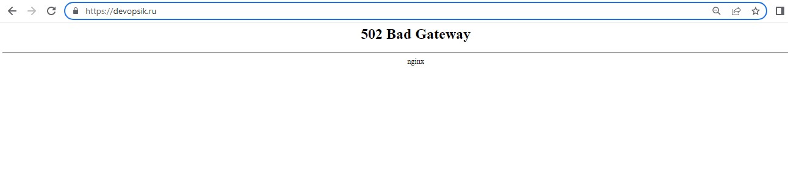
___

### Установка кластера MySQL

`ansible-playbook MySQL.yml -i hosts`

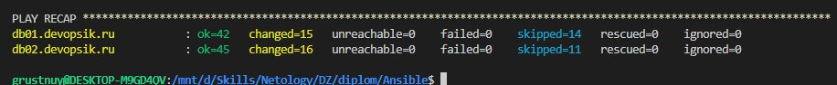

Проверка репликации

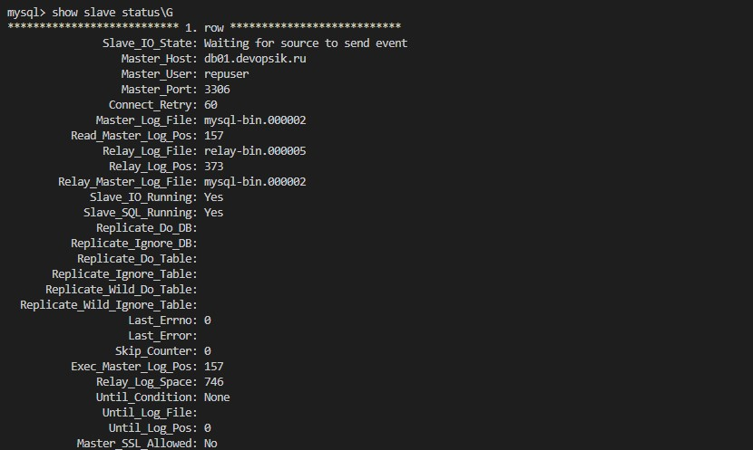

___

### Установка WordPress

`ansible-playbook wordpress.yml -i hosts`

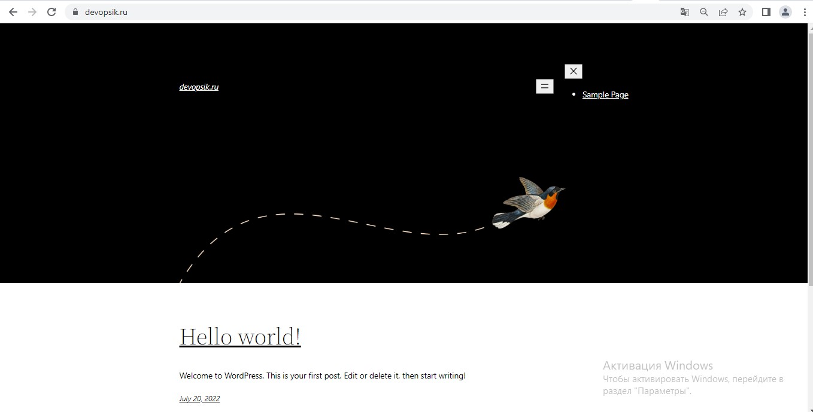

---
### Установка Gitlab CE и Gitlab Runner


`ansible-playbook wordpress.yml -i hosts`

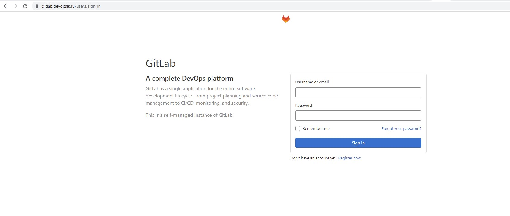

Подключаемся по ssh на gitlab.devopsik.ru и переcоздаем пароль для учетки root `sudo gitlab-rake "gitlab:password:reset[root]"`


Перед установкой Gitlab Runner в файле [src/Ansible/roles/gitlab-runner/defaults/main.yml](src/Ansible/roles/gitlab-runner/defaults/main.yml) указываем gitlab_runner_coordinator_url и gitlab_runner_registration_token.

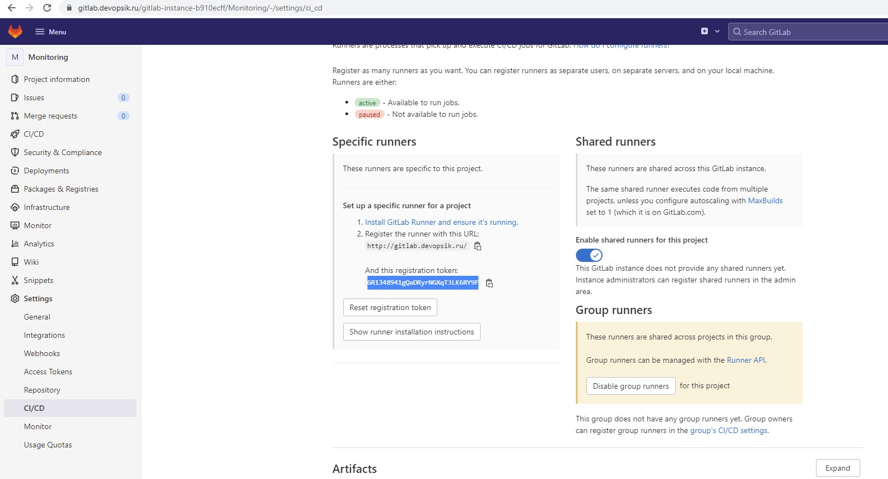

`ansible-playbook runner.yml -i hosts`

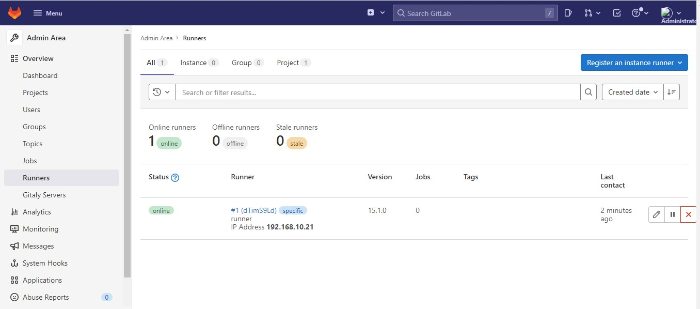

Для выполнения автоматического деплой на сервер `app.devopsik.ru` при коммите в репозиторий с WordPress была разработана следующая job:

```
before_script:
  - eval $(ssh-agent -s)
  - echo "$ssh_key" | tr -d '\r' | ssh-add -
  - mkdir -p ~/.ssh
  - chmod 700 ~/.ssh

stages:         
  - deploy

deploy-job:      
  stage: deploy
  script:
    - echo "Deploying application..." 
    - ssh -o StrictHostKeyChecking=no grustnuy@app.devopsik.ru sudo chown grustnuy /var/www/wordpress/ -R
    - rsync -vz -e "ssh -o StrictHostKeyChecking=no" ./* grustnuy@app.devopsik.ru:/var/www/wordpress/
    - ssh -o StrictHostKeyChecking=no grustnuy@app.devopsik.ru rm -rf /var/www/wordpress/.git
    - ssh -o StrictHostKeyChecking=no grustnuy@app.devopsik.ru sudo chown www-data /var/www/wordpress/ -R
```	
	

Настроиваем CI/CD систему для автоматического развертывания приложения при изменении кода.

Создаем переменную с ключом для доступа к серверу.

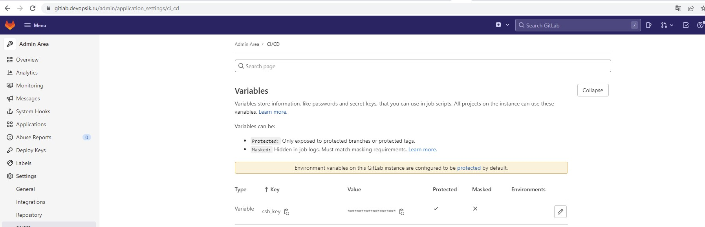

Проверяем работу.

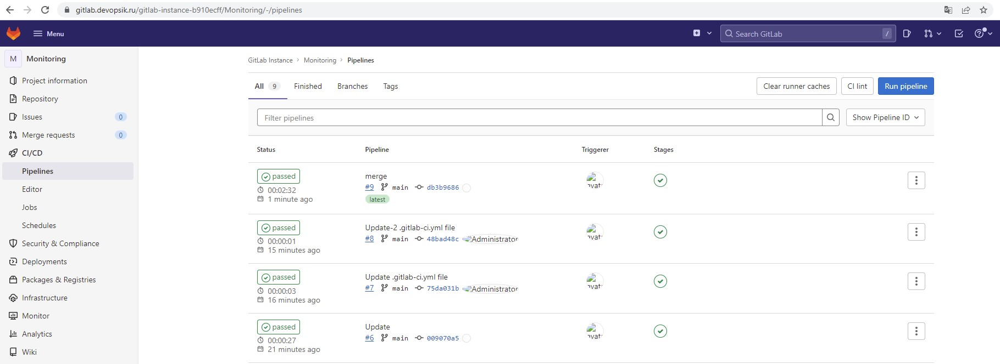

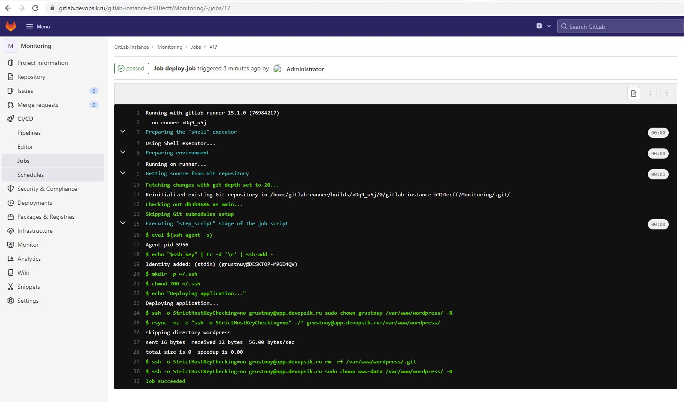


___
### Установка Prometheus, Alert Manager, Node Exporter и Grafana

`ansible-playbook NodeExporter.yml -i hosts`

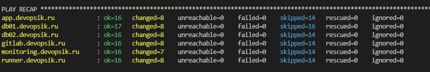

`ansible-playbook monitoring.yml -i hosts`
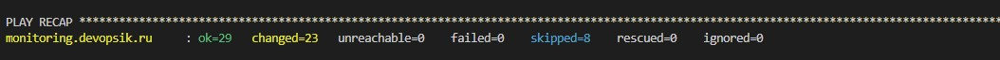


- Grafana
Данные для входа в Grafana admin/admin.

Настраиваем Data Sources и импортируем шаблоны из [templates_grafana](src/templates_grafana).

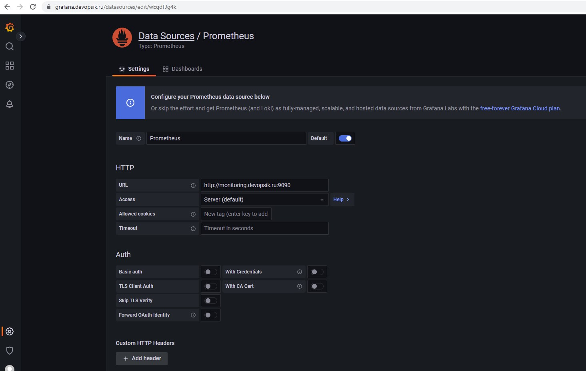


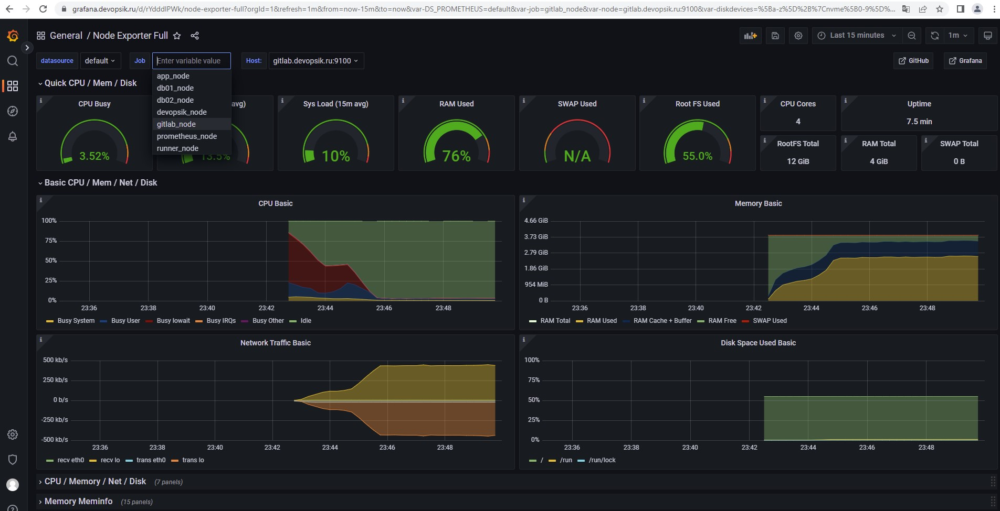

- Prometheus

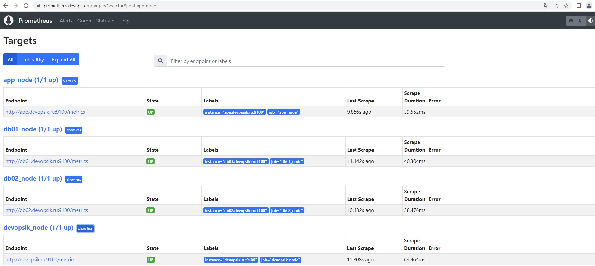

- Alert Manager

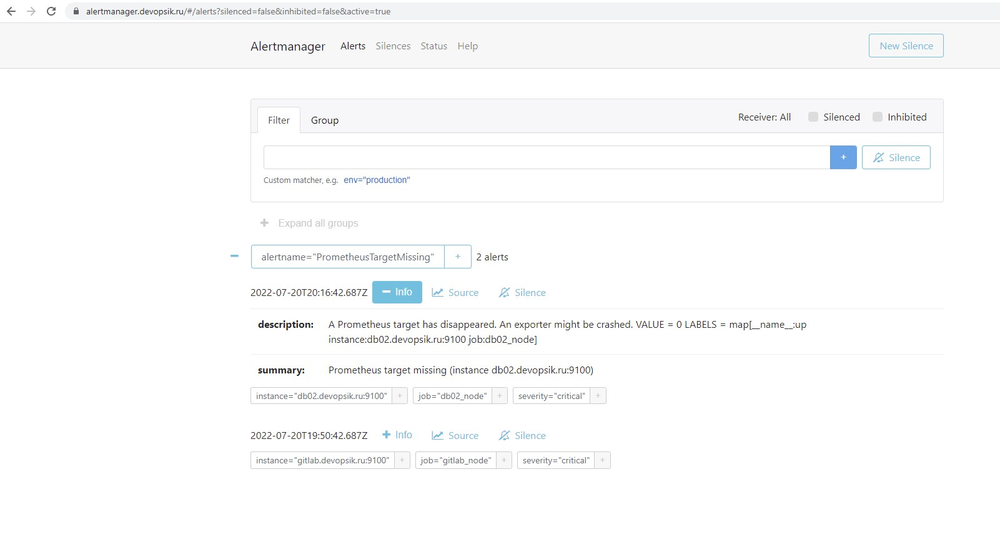
